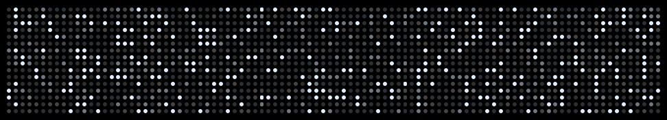
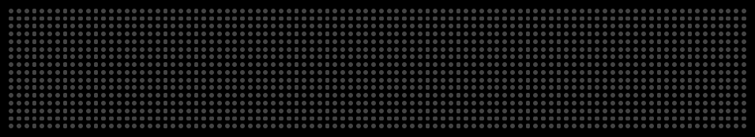
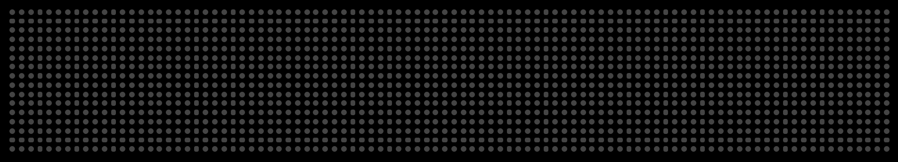
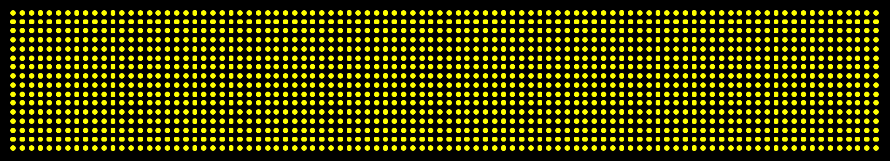
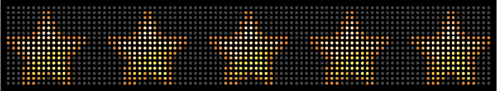
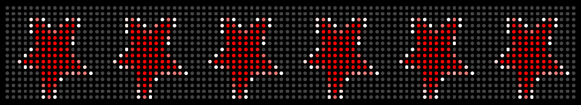

# Macros  

These are all the available display macros for BigDots.io LED displays.

### Twinkle



### Config options

```js
{
  color: '#FFFFFF'
}
```

### Marquee

The classic LED panel usecase...



```js
{
  color: '#FFFFFF',
  backgroundColor: '#000000',
  font: 'system-16',
  text: 'Replace with marquee text!',
  speed: 50
}
```

### Programmable

It's all on you. Use the the Node API to do whatever you want!



### Counter

Display a sum of an item or items via json from a url. The url should return json in the following structure...

```json
[{ "count": 12540 }]
```


```js
{
  loadingBarColor: '#333333',
  iconColor: '#FFFFFF',
  countColor: '#FFFFFF',
  icon: null,
  url: '',
  refreshInterval: 60
}
```

### Solid Color



```js
{
  color: '#FFFFFF'
}
```

### Image



GIF friendly!


```js
{
  url: '',
  speed: 10 // for GIFs
}
```
